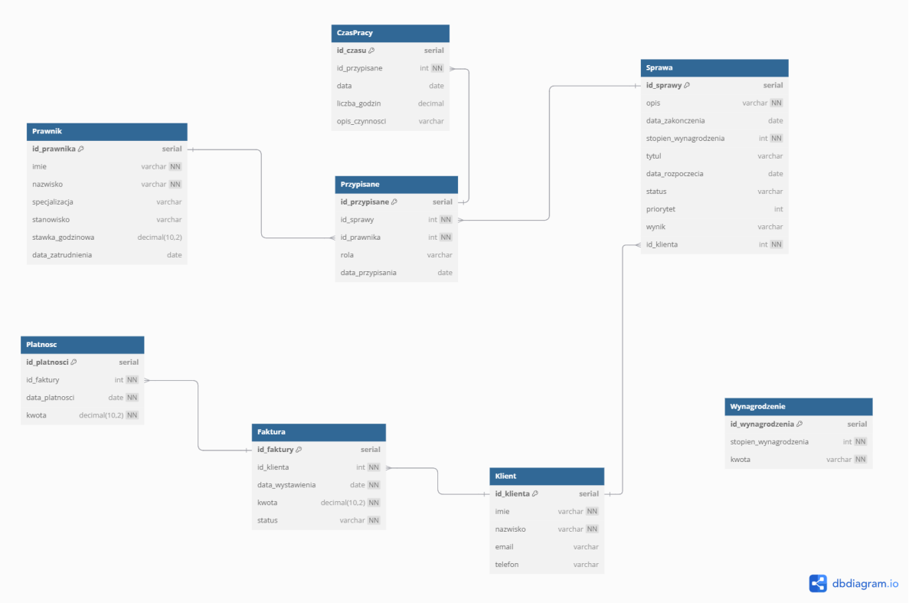

# Kancelaria Prawna

**Kancelaria Prawna** to aplikacja webowa napisana w architekturze **Model-View-Controller (MVC)** z wykorzystaniem **ASP.NET Core** oraz bazy danych **PostgreSQL**. Aplikacja służy do zarządzania danymi kancelarii prawniczej, w tym prawnikami, sprawami, klientami oraz płatnościami.

---

## 📌 Funkcjonalności

- **Zarządzanie prawnikami** – dodawanie, edytowanie i usuwanie prawników.
- **Obsługa spraw** – przypisywanie prawników do spraw, śledzenie statusu oraz wyniku sprawy.
- **Zarządzanie klientami** – dodawanie klientów i powiązanych spraw.
- **System faktur i płatności** – generowanie faktur, śledzenie płatności oraz kontrola statusu faktur.
- **Raportowanie** – generowanie raportów dotyczących zarobków prawników, aktualnych spraw i statusu faktur.

---

## 🛠️ Technologie

- **Backend:** ASP.NET Core, Entity Framework Core, Npgsql
- **Frontend:** HTML, CSS
- **Baza danych:** PostgreSQL
- **Inne:** Tembo.io

---

## 🖼️ Diagram ERD

  
